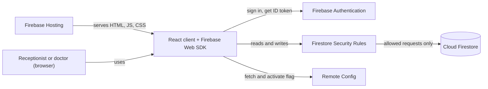

# Patient Onboarding

A small clinic patient-management app. A receptionist registers patients and a doctor reviews, edits and deletes them. It is a React app on Firebase with no backend server of my own.

Live site: https://patient-onboarding-dj.web.app

## How it works

The browser talks to Firebase directly through the Firebase Web SDK. There are four Firebase services involved:

- **Authentication** (email/password) says who is signed in.
- **Cloud Firestore** stores the data in two collections.
- **Security Rules** (`firestore.rules`) decide what each role may do. The UI only hides buttons; the rules are what actually allow or deny a request.
- **Remote Config** holds one flag, `show_delete_button`, which controls whether the doctor sees the Delete button.



### Data

`/users/{uid}` is one role profile per account. The document ID is the Authentication UID and the document has two fields: `name` and `role` (`"receptionist"` or `"doctor"`). I create these by hand in the Firebase console. The app can read only the signed-in user's own profile and can never write one.

`/patients/{patientId}` has `patientId`, `name`, `phone`, `condition`, `createdAt` and `updatedAt`. The text fields must be trimmed and non-empty, with limits of 100, 20 and 500 characters. The timestamps are server time. No other fields are accepted, and `patientId` and `createdAt` cannot change after create.

### Roles

| Action | Receptionist | Doctor | Signed out / no valid role |
| --- | --- | --- | --- |
| Create patient | Allowed | Denied | Denied |
| Read patient list | Allowed | Allowed | Denied |
| Edit patient | Denied | Allowed | Denied |
| Delete patient | Denied | Allowed | Denied |

The rules look up the role from `/users/{uid}` on every request, so the role never comes from the client. A missing profile or any other role value gives no access.

### Code layout

- `src/firebase.js` initialises the SDK from the `VITE_FIREBASE_*` values in `.env.local`.
- `src/services/` is the only place that calls Firebase (auth, users, patients, remote config).
- `src/hooks/` turns those calls into React state (`useAuthProfile`, `usePatients`, `useRemoteConfig`).
- `src/components/` is the UI. There is no router and no state library.
- `src/validation.js` and `src/constants.js` hold the form checks and limits, which mirror the ones in `firestore.rules`.

## Workflow

1. A user opens the site and signs in with their clinic email and password.
2. The app reads `/users/{uid}` for that account. If the profile is missing or the role is not valid, it shows a problem screen instead of the patient list.
3. The receptionist sees the registration form and the patient list. Adding a patient writes a new document to `/patients`.
4. The doctor sees the same list with no form. The list is a live Firestore listener, so a patient the receptionist adds appears without a reload. It shows the 50 most recent patients.
5. The doctor can edit a patient's name, phone and condition. Each edit updates `updatedAt`.
6. The doctor sees Delete only when `show_delete_button` is `true` in Remote Config. Pressing "Refresh config" in the app fetches the latest value, so the button can be turned on and off from the console without a redeploy.
7. Logout returns to the login page.

## Testing

You need Node.js 24, and JDK 21 for anything that uses the emulators. The Firebase CLI is a dev dependency, so run it as `npx firebase ...`.

```bash
npm install
cp .env.example .env.local   # then fill in the Firebase web app config
```

| Command | What it does |
| --- | --- |
| `npm test` | Unit tests in `tests/unit/` (validation, formatters, error messages, profile status). No emulator needed |
| `npm run test:rules` | Starts a temporary Firestore emulator and runs `tests/rules/firestore.rules.test.js` against `firestore.rules`. Needs Java |
| `npm run lint` | ESLint |

`npm run test:rules` uses port 8080 and the fake project ID `demo-patient-onboarding`, so stop `npm run emulators` first. It cannot touch the cloud project.

To try the app by hand against local emulators:

1. Terminal 1: `npm run emulators` and wait for "All emulators ready".
2. Terminal 2: `npm run seed`. This creates two local accounts and their profiles. Emulator data is in memory, so run it again after every emulator restart.
3. Set `VITE_USE_EMULATORS=true` in `.env.local`.
4. Terminal 2: `npm run dev` and open the address Vite prints.
5. Sign in as `receptionist@example.test` or `doctor@example.test`. The password is printed by the seed script. These accounts exist only in the emulator.
6. Set `VITE_USE_EMULATORS=false` again when done.

There is no Remote Config emulator, so even a local run asks the real project for the flag.

## Deploying and production

Production is the Firebase project `patient-onboarding-ba4f4` (free Spark plan, Firestore in `asia-south1`). The app is served from the Hosting site `patient-onboarding-dj`.

```bash
npx firebase login                                             # once, opens a browser
npx firebase deploy --only firestore:rules,firestore:indexes   # rules and the index file
npx firebase deploy --only remoteconfig                        # publishes show_delete_button = false
npx firebase deploy --only hosting                             # runs npm run build first
```

Things to know about production:

- **Build config.** The hosting deploy builds from `.env.local`, so that file must hold the real project's config and `VITE_USE_EMULATORS=false`. A production build can never use the emulators, because `src/firebase.js` also checks `import.meta.env.DEV`.
- **Web config is public.** The `VITE_FIREBASE_*` values end up in the JavaScript every visitor downloads. They are not secrets; Authentication and the rules protect the data. A password or service-account key must never go in a `VITE_*` variable.
- **Rules.** `firestore.rules` is the source of truth. Publish rules with the deploy command, not by editing them in the console.
- **Accounts.** There is no sign-up screen. I add each account under Authentication in the console, then create `/users/<UID>` in Firestore with `name` and `role`. The document ID has to be exactly the UID. The current accounts are `rec@example.com` (receptionist) and `doc@test.com` (doctor). Passwords are not kept in the repo.
- **Remote Config.** Deploying `remoteconfig` replaces the published template, which resets `show_delete_button` to `false`. To flip the flag, change it in the console and publish. The app caches the value for `VITE_RC_FETCH_INTERVAL_SECONDS` (12 hours by default in a production build), so "Refresh config" inside that interval is answered from cache.
